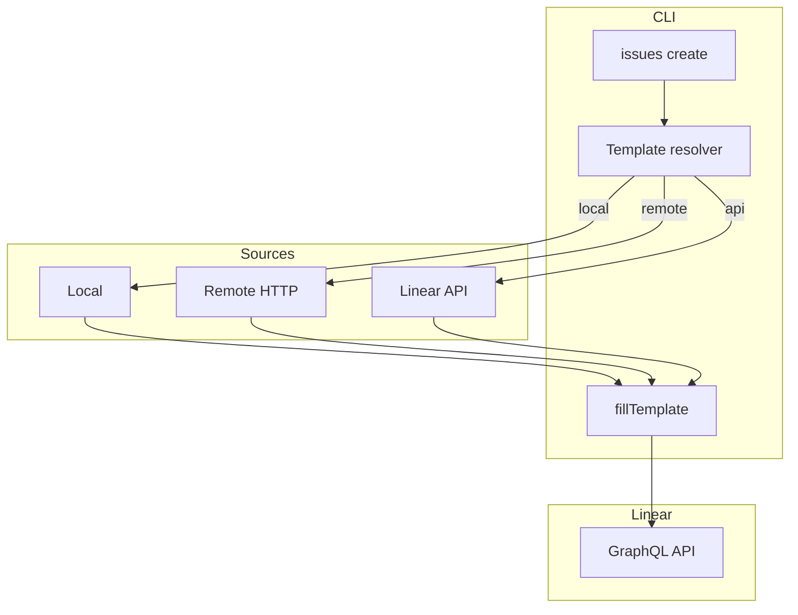

# Architecture Overview

## Components
- CLI (Cobra commands) under `cmd/`
- Linear GraphQL client under `internal/api/`
- Config loader under `internal/config/`
- Output utilities under `internal/output/`

## Issue creation paths

## Files of interest
- `cmd/issues_adv.go`: flags, template resolution, interactive prompts
- `internal/api/linear.go`: GraphQL queries/mutations, template helpers
