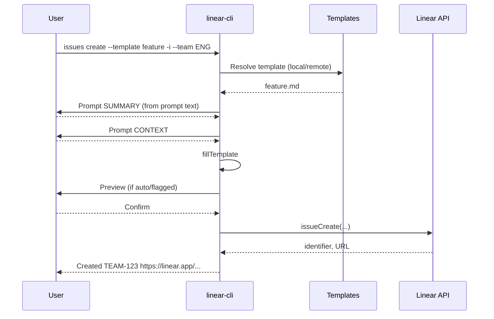

# Issue Workflows

This document visualizes the primary flows for creating issues with `linear-cli`.

## High-level create flow
```mermaid
flowchart TD
  A[Start: linear-cli issues create] --> B{Template input?}
  B -- --template-id --> TID[Server-side from templateId]
  B -- --template --> C{Source}
  B -- no template --> D[Use --description as provided]

  C -- api --> C1[Fetch via Linear API\nby id or by name+team]
  C -- remote --> C2[Fetch https URL\nor <base>/<name>.md]
  C -- local --> C3[Read file path or\nresolve from search dirs]

  C1 --> E[Template content]
  C2 --> E
  C3 --> E

  E --> F{Interactive?}
  F -- yes --> G[Prompt for missing {{KEY}}\nusing optional prompt text]
  F -- no --> H[Use provided vars only]
  G --> I[fillTemplate]
  H --> I[fillTemplate]

  I --> J{Preview auto?}
  J -- yes --> K[Show preview\n(--yes continues, else exit)]
  J -- no --> L[Proceed]

  TID --> M[issueCreate(input:{teamId,templateId,title})]
  L --> N[issueCreate(input:{teamId/projectId,title,description,...})]
  M --> O[Created: identifier + URL]
  N --> O
```

## Interactive prompting details
- Placeholders: `{{KEY}}` or `{{KEY|Prompt text...}}`
- Missing keys prompt in-order; prompt text is displayed if present.
- `--fail-on-missing` errors if unresolved placeholders remain.


