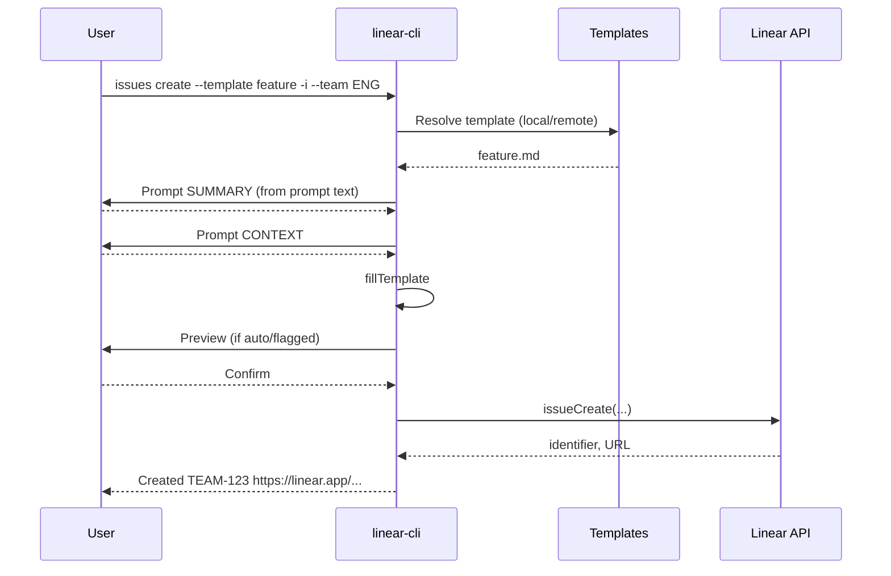

# Issue Workflows

This document visualizes the primary flows for creating issues with `linear-cli`.

## High-level create flow (team-only, interactive by default)
```mermaid
flowchart TD
  A[Start: linear-cli issues create --team ENG] --> B{Interactive}
  B -- default:on --> C{Type (Feature/Bug/Spike)}
  C --> D{Template available?\n(API→Remote→Local)}
  D -- yes --> E[Load + fillTemplate]
  D -- no --> F[Prompt multiline description]
  E --> G{Preview auto?}
  F --> G
  G -- yes --> H[Preview + confirm]
  G -- no --> I[Continue]
  I --> J[Pick Priority (1-4)]
  J --> K[Pick State (Backlog/Todo/etc from API)]
  K --> L[Pick Assignee (incl. (me))]
  L --> M[Pick Project (team projects)]
  M --> N[Optional: pick labels (multi)]
  N --> O[Create issue]
  O --> P[Created: identifier + URL]
```

## Interactive prompting details
- Placeholders: `{{KEY}}` or `{{KEY|Prompt text...}}`
- Missing keys prompt in-order; prompt text is displayed if present.
- `--fail-on-missing` errors if unresolved placeholders remain.


