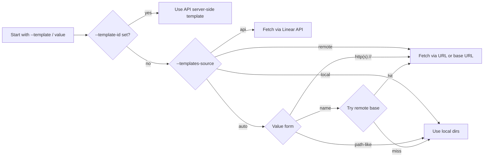
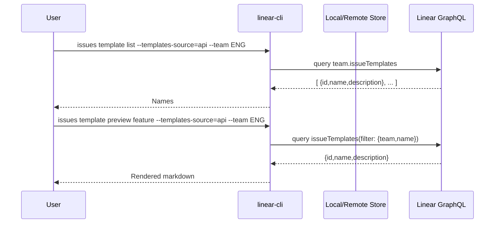

# Templates

`linear-cli` supports three template sources:
- Local files (search dirs)
- Remote base URL (http/https)
- Linear API (team-scoped)

## Resolution precedence

## Local search order
- `--templates-dir`
- `$LINEAR_TEMPLATES_DIR`
- `UserConfigDir/linear/templates`
- `~/.config/linear/templates`

## Remote base
- Flag: `--templates-base-url`
- Env: `LINEAR_TEMPLATES_BASE_URL`
- Names resolve to `<base>/<name>.md`
- Listing tries `<base>/index.json` containing `["bug", "feature"]` or `{ "templates": [...] }`

## Linear API
- List: team-scoped templates
- Preview: fetch by `id` or by `name` within team
- Create: server-side with `--template-id` if supported by `IssueCreateInput`

